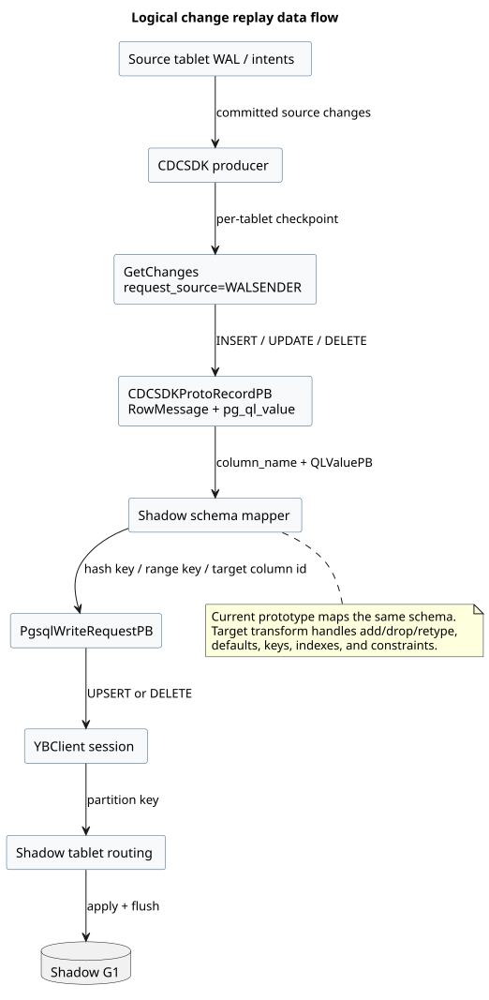

# Change Capture and Replay

## Goal

The snapshot copy represents source state at `S`. Replay makes the shadow reflect
all later committed user changes up to a barrier `F` without blocking writers
during the long copy.



PlantUML source: [05-replay-dataflow.puml](diagrams/05-replay-dataflow.puml).

## Stream type

The prototype creates an internal, slot-less CDCSDK stream:

```text
source             CDCSDK
bound tables       source physical table only
record type        PG_FULL
snapshot option    NOEXPORT_SNAPSHOT
consumer           master-owned replay code
```

"Slot-less" means there is no user-visible PostgreSQL replication slot or
VirtualWAL/LSN lifecycle. The migration owns stream creation, per-tablet
GetChanges checkpoints, and retention. It must eventually own deletion too;
terminal-path stream cleanup is not implemented yet.

`CDCSDKRequestSource::WALSENDER` is independent from replication-slot ownership.
It is a per-GetChanges formatting flag. In WALSENDER mode, YSQL values arrive as
clean `DatumMessagePB.pg_ql_value` (`QLValuePB`) rather than PostgreSQL binary
datum scalar fields. `WalsenderQlValueSmoke` validates this on a normal user
tablet with a non-slot stream.

## Arming order

The migration:

1. Ensures the `cdc_state` system table exists during admission.
2. Creates the stream before the source snapshot.
3. Installs WAL/history retention barriers on source tablets.
4. Takes the copy snapshot and persists `S`.

Pre-creating `cdc_state` is important: lazily creating it while the catalog
background thread synchronously waits for table creation can deadlock the leader
loop that must drive its tablet to `RUNNING`.

## Current replay algorithm

`CatalogManager::ReplayGenerationChanges`:

1. Builds an internal `YBTable` for the hidden shadow from master metadata.
2. Chooses `F = master clock now` when REPLAYING starts.
3. For each source tablet, calls GetChanges starting from a checkpoint anchored
   at `snapshot_time = S`.
4. Requests WALSENDER values.
5. Converts INSERT/UPDATE to a `PGSQL_UPSERT` and DELETE to `PGSQL_DELETE`.
6. Maps values by column name to the shadow schema:
   hash keys -> `partition_column_values`, range keys ->
   `range_column_values`, other columns -> `column_values` with target column id.
7. Flushes each mutation through a YBClient session.
8. Advances the in-memory checkpoint and repeats until the tablet reports
   `safe_hybrid_time >= F`.
9. Persists aggregate `cutover_barrier_ht = F`.

The shadow YBSchema version is copied from `SysTablesEntryPB.version`; SchemaPB
does not contain the version, and leaving it at the default causes
`PGSQL_STATUS_SCHEMA_VERSION_MISMATCH`.

## Current limitations

- The submitted DDL is not applied. The shadow has the source schema, so the
  prototype proves transport/apply but not a real structural rewrite.
- BEGIN/COMMIT records are ignored. Mutations are applied one at a time, so a
  multi-row or cross-tablet source transaction is not atomic on the shadow.
- Per-tablet checkpoints are not persisted. A resumed phase starts from `S` and
  relies on idempotent UPSERT/DELETE behavior.
- Replay is sequential by source tablet and flushes one mutation at a time.
- Added target columns absent from a source record are skipped; full transform
  semantics are not defined.
- The capture stream is not deleted on terminal job paths yet.
- Writes after `F` are not captured by the current cutover; see
  [Cutover and fencing](cutover-and-fencing.md).

## Target replay semantics

Transport can be at least once, but target effects must be exactly once. A
durable replay record should carry:

```text
migration_id, source transaction id, source tablet/OpId/write id,
source commit HT, mutation ordinal, source and target schema versions
```

The target should preserve transaction boundaries, apply one source transaction
atomically, and update an idempotency marker/checkpoint in the same transaction.
Two frontiers are needed:

- capture frontier: changes durably queued;
- apply frontier: changes durably visible in the shadow.

Source CDC checkpoints may advance to capture; retained queue entries may be
removed only through apply.

## Why not raw KV replay

For a non-colocated same-schema clone, DocDB keys can be transplanted and packed
schema versions remapped. A real online `ALTER`, however, intentionally changes
the target physical schema and possibly key/partition layout. Logical replay is
therefore required to re-encode source values through the target schema and
transform plan.

## Semantic errors

An asynchronous target constraint failure cannot reject an already committed
source transaction. The production design must stop checkpoint advancement,
keep `G0` authoritative, persist the failing source transaction and redacted
key, and classify the migration as repairable/cancellable rather than exposing a
partially valid target.
