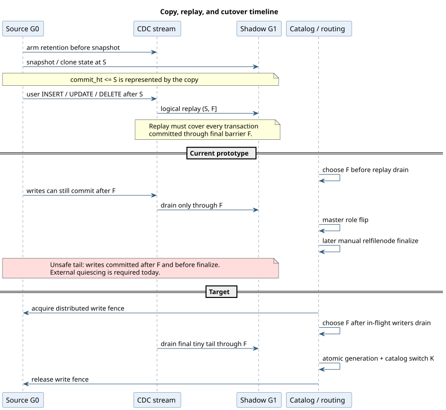
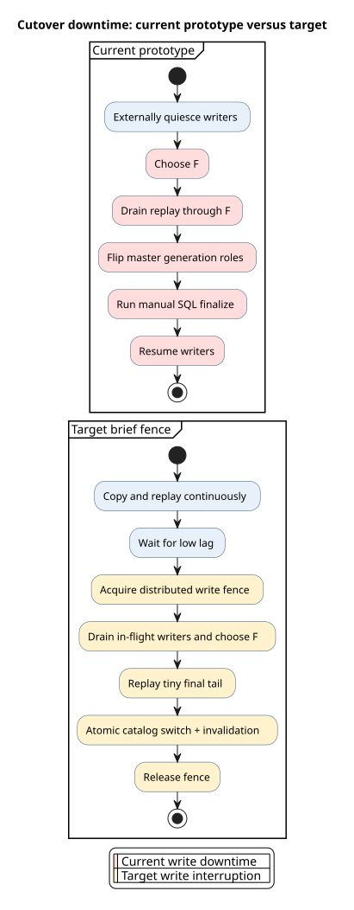

# Cutover and Fencing

## Correctness requirement

Cutover must not lose writes committed to the source after the replay barrier,
and every backend must resolve the logical relation to one physical generation.



PlantUML source: [04-copy-replay-timeline.puml](diagrams/04-copy-replay-timeline.puml).

## Current prototype

The current sequence is:

1. REPLAYING chooses `F = master clock now`.
2. Replay drains each source tablet to `safe_hybrid_time >= F`.
3. CUTOVER flips master roles: `G0 -> RETIRED`, `G1 -> ACTIVE`.
4. A caller separately runs `yb_finalize_online_schema_change`.
5. Finalize updates `pg_class.relfilenode` and invalidates the local relcache.

YSQL resolves physical storage from `pg_class.relfilenode`, not the master
generation role, so step 4 is the load-bearing traffic redirect.

### Current unsafe tail

Writes may commit to `G0` after `F` and before SQL finalize. They are not replayed
and become invisible after the relation switches to `G1`.

For data safety today, writers must be externally quiesced before REPLAYING
chooses `F` and remain quiesced until finalize commits. Current downtime is:

```text
remaining replay drain + role flip + SQL finalize
```

This is much shorter than copying the full table under a lock, but it is not yet
the intended cutover-only interruption.

## Target brief-fence protocol



PlantUML source: [06-cutover-current-vs-target.puml](diagrams/06-cutover-current-vs-target.puml).

Target sequence:

1. Copy is complete and continuous replay lag is small.
2. Acquire a distributed write fence on the full relation/index/partition
   hierarchy in canonical OID order.
3. Drain in-flight and prepared transactions.
4. Choose `F` only after no new source write can start.
5. Wait for every source tablet to resolve through `F`.
6. Apply every transaction with `S < commit_ht <= F` and verify no partial
   transaction remains.
7. Atomically install target PostgreSQL schema/relfilenodes, flip generation
   roles, bump the database catalog version, and publish invalidations.
8. Release the fence.

No copy, full validation scan, or index build may happen while the fence is held.
On timeout, release the fence and return to continuous replay.

## Fencing primitive

`LOCK TABLE ... IN ACCESS EXCLUSIVE MODE` is cluster-wide only when distributed
object locking is enabled (`enable_object_locking_for_table_locks` and its
prerequisites). This is disabled by default on macOS, so the strict test belongs
on the Linux test cluster.

Expected write interruption for a caught-up table is:

```text
conflicting transaction drain + object-lock fanout + tiny CDC tail drain
+ catalog commit/invalidation
```

With no long transaction and low lag, the design target is tens to low hundreds
of milliseconds. It is not a guaranteed bound until measured under load.

## Catalog and cache work

Near-term OID-preserving activation must coordinate:

- `pg_class.relfilenode` and target physical fields;
- `pg_attribute`, defaults, constraints, and index metadata changed by the DDL;
- master `ACTIVE`/`RETIRED` generation roles;
- database catalog version bump as a breaking change;
- YSQL relcache invalidation;
- pggate/tserver/YBClient table and partition caches;
- request fencing so stale plans cannot write to a retired generation.

The original relation OID remains referenced by views, FKs, triggers, policies,
publications, ACLs, comments, and dependencies.

## Failure decision

- Before the catalog cutover commit `K`, `G0` remains authoritative and the
  migration can release the fence and resume/cancel.
- An ambiguous cutover is resolved from the PostgreSQL transaction status and
  committed relfilenode, never from names or in-memory phase.
- After `K`, recovery is roll-forward: make `G1` consistently active and retire
  `G0`.

## Long-term pointer model

For large partition/index bundles, editing each relfilenode is O(number of
relations). The long-term model stores an active physical generation-group
pointer under the logical table. Transactions pin a pointer epoch on first
access; cutover activates one pointer and historical systems select generations
by validity interval around `K`.
