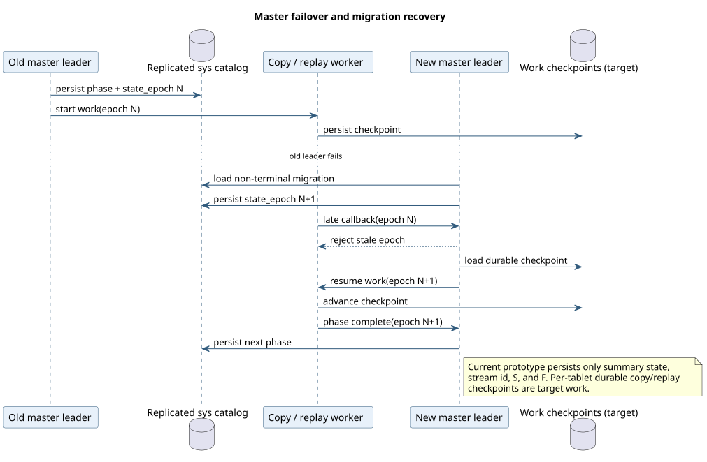

# Failure Recovery and Cleanup

## Current behavior

The durable migration summary is reloaded when a master becomes leader.
Non-terminal jobs receive the new leader term in `state_epoch` and resume from
their persisted phase on a later executor tick.

PlantUML source: [08-failure-recovery.puml](diagrams/08-failure-recovery.puml).

Current idempotency boundaries:

- Admission with the same non-empty `request_id` returns the existing job.
- Shadow creation is skipped when `shadow_table_id` is already persisted.
- Replay can restart from `S`; UPSERT/DELETE makes the tested same-schema row
  effects idempotent, but transaction-level exactly-once behavior is absent.
- Role flip writes both table entries in one master sys-catalog batch.
- PostgreSQL finalize is a separate operation and must be made explicitly
  idempotent/authoritative for ambiguous commits.

## Failure matrix

| Failure point | Current behavior | Required behavior |
|---|---|---|
| Before durable admission | No job returned | Retry with request id |
| After admission response is lost | Existing request id resolves the job | Same |
| During shadow creation | Phase resumes; persisted shadow id prevents duplicate create | Clean partially-created tablets if create never completed |
| During copy | Phase currently reruns blocking clone/restore | Persist per-tablet copy checkpoints and resume safely |
| During replay | Starts again from `S` | Resume durable per-tablet/transaction checkpoints |
| During final fence | Not implemented | Release fence on timeout and return to replay |
| Between role flip and relfilenode finalize | Inconsistent current prototype window | One authoritative atomic/roll-forward cutover decision |
| After cutover commit | Manual cleanup absent | Roll forward; retain then GC old generation |

## Cancellation

Before cutover, cancellation should:

1. Persist `CANCELLING` and bump/fence worker epoch.
2. Stop copy/replay workers.
3. Delete the internal CDCSDK stream and release WAL/history retention.
4. Drop the shadow generation and target snapshots/restorations.
5. Remove per-work-unit checkpoints.
6. Persist `CANCELLED` while retaining the summary for observation.

The current executor only persists `CANCELLING -> CANCELLED`; resource cleanup is
not implemented.

After authoritative cutover commit `K`, cancellation is no longer valid. Recovery
is roll-forward and old-generation cleanup follows retention owners.

## Retention owners

Old source data and WAL may be retained by several independent systems:

- migration replay/checkpoints;
- external logical or gRPC CDC consumers;
- PITR schedules;
- backup/restore chains;
- rollback grace period.

GC can delete `G0` only after every owner has crossed `K` or expired under its
own policy. Stream deletion must be explicit; otherwise an abandoned internal
CDCSDK stream can retain WAL indefinitely.

## Resource pressure

Hard retention can threaten source availability. The production policy should
prefer the active source table over the migration:

- monitor retained WAL/history bytes and free disk;
- throttle or pause copy/replay before critical pressure;
- cancel the migration and release its retention owner at a hard threshold;
- persist a classified terminal error and cleanup status.

Metrics, pressure thresholds, tuning, troubleshooting, and support-bundle
requirements are specified in
[Performance, observability, and supportability](performance-observability.md).

## Required recovery tests

- Master, source leader, shadow leader, and tserver restart in every phase.
- Crash after target apply but before checkpoint.
- Master failover with stale worker callback delivery.
- Cancellation during copy and replay.
- Final-fence timeout with writer recovery.
- Crash immediately before/after catalog cutover commit.
- Retention cleanup on success, cancellation, and semantic failure.
- Tablet split while a checkpoint refers to the parent lineage.
