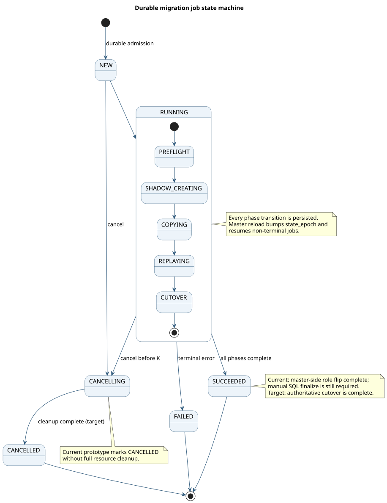

# Migration Job and SQL API

## Current versus target

| | Current prototype | Target |
|---|---|---|
| Identity | Master-generated migration id stored in sys catalog | Native UUID contract across SQL/admin APIs |
| Submission | Explicit SQL function, durable before return | Same async primitive, optional blocking convenience syntax |
| State | One summary entity; aggregate progress surfaces | Summary plus durable per-tablet/range work table |
| Execution | One phase per catalog background tick; heavy work is synchronous | Asynchronous workers with durable checkpoints and resource scheduling |
| Finalization | Separate manual SQL function | Coordinated/fenced cutover driven by the job |

## Why an explicit asynchronous API

Ordinary PostgreSQL DDL returns `PGRES_COMMAND_OK`. Returning a migration id as a
row would change libpq/JDBC behavior, while adding it to the command tag is not a
portable driver contract. Online schema change therefore uses an explicit,
row-returning function and leaves ordinary `ALTER TABLE` wire behavior intact.

The server owns the canonical migration id. An optional `request_id` is a client
idempotency token used to resolve a retry after a lost response.

## SQL surface

```sql
SELECT yb_start_online_schema_change(
  't'::regclass,
  -- Prototype: recorded for now; target-schema application is not landed.
  'ALTER TABLE t ALTER COLUMN value TYPE bigint',
  NULL -- optional request_id
);

SELECT * FROM yb_schema_migrations
WHERE migration_id = '...';

SELECT * FROM yb_schema_migration_progress
WHERE migration_id = '...';

SELECT yb_cancel_schema_migration('...');

-- Prototype-only separate cutover half.
SELECT yb_finalize_online_schema_change('t'::regclass, '...');
```

The start function sends the current physical relfilenode OID, not the stable
`pg_class.oid`, so the master resolves the active physical source generation.

## Durable summary entity

`SysSchemaMigrationEntryPB` is stored as a dedicated `SCHEMA_MIGRATION`
sys-catalog entity keyed by the server-generated id. Current fields include:

```text
kind, state, phase, state_epoch
database_oid, table_oid, submitted_by, submitted_ddl
created_ht, updated_ht, completed_ht
terminal_error, request_id
shadow_table_id
capture_stream_id, copy_snapshot_ht (S), cutover_barrier_ht (F)
```

The entity is deliberately generic (`kind = ONLINE_TABLE_REWRITE` first) so
other long-running schema operations could use the same status model later.

## Lifecycle



PlantUML source: [07-job-state-machine.puml](diagrams/07-job-state-machine.puml).

Current lifecycle states:

```text
NEW -> RUNNING -> SUCCEEDED | FAILED
NEW | RUNNING -> CANCELLING -> CANCELLED
```

Current phases within `RUNNING`:

```text
PREFLIGHT -> SHADOW_CREATING -> COPYING -> REPLAYING -> CUTOVER
```

Each transition is persisted before the executor moves on. On master reload,
non-terminal jobs are restored and `state_epoch` is bumped to fence callbacks
from a previous leader.

In the current prototype, `SUCCEEDED` means the master-side `CUTOVER` phase
finished (generation roles were flipped). The caller must still run the separate
SQL finalize while writers remain quiesced before YSQL routes through the shadow
relfilenode. The target job includes authoritative finalize/cutover before it can
report success.

## Observability

`yb_schema_migrations` is the summary surface. `yb_schema_migration_progress`
currently derives progress from the summary job and phase; the target design
adds one durable row per source tablet/range work unit:

```text
key: (migration_id, work_kind, source_table_id, tablet_lineage_id, range_start)
val: state, copy checkpoint, CDC checkpoint, resolved_ht, applied_ht,
     counters, worker_epoch, attempt, error
```

Raw counters and phase should remain authoritative. A percentage is advisory
because tablet splits change denominators and replay lag is time-based.

## Code map

- `src/yb/master/catalog_entity_info.proto`: durable job entity.
- `src/yb/master/schema_migration/schema_migration_manager.{h,cc}`: admission,
  state transitions, phase execution, failover reload.
- `src/yb/master/master_admin.proto`: start/get/list/cancel RPCs.
- `src/yb/tserver/pg_client.proto`: YSQL-facing job metadata.
- `src/postgres/src/backend/utils/misc/pg_yb_utils.c`: SQL C functions.
- `src/postgres/src/backend/catalog/yb_system_views.sql`: read-only views.

## Remaining work

- Move copy/replay off the catalog background thread.
- Add durable work-unit checkpoints and retries.
- Make cancel abort workers and release all owned retention/resources.
- Integrate finalize into the authoritative job rather than a manual SQL call.
- Define retention/pruning for terminal summary and detail rows.
