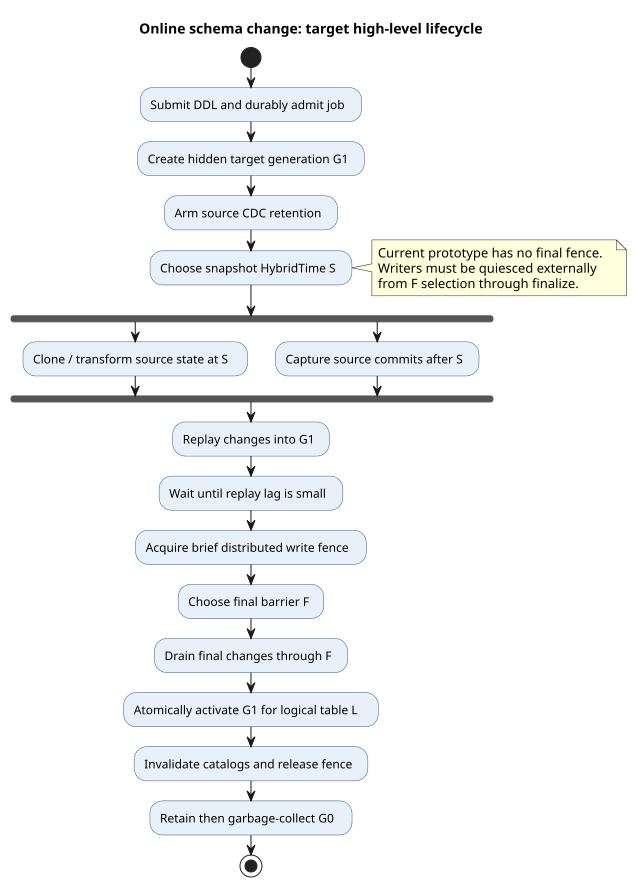
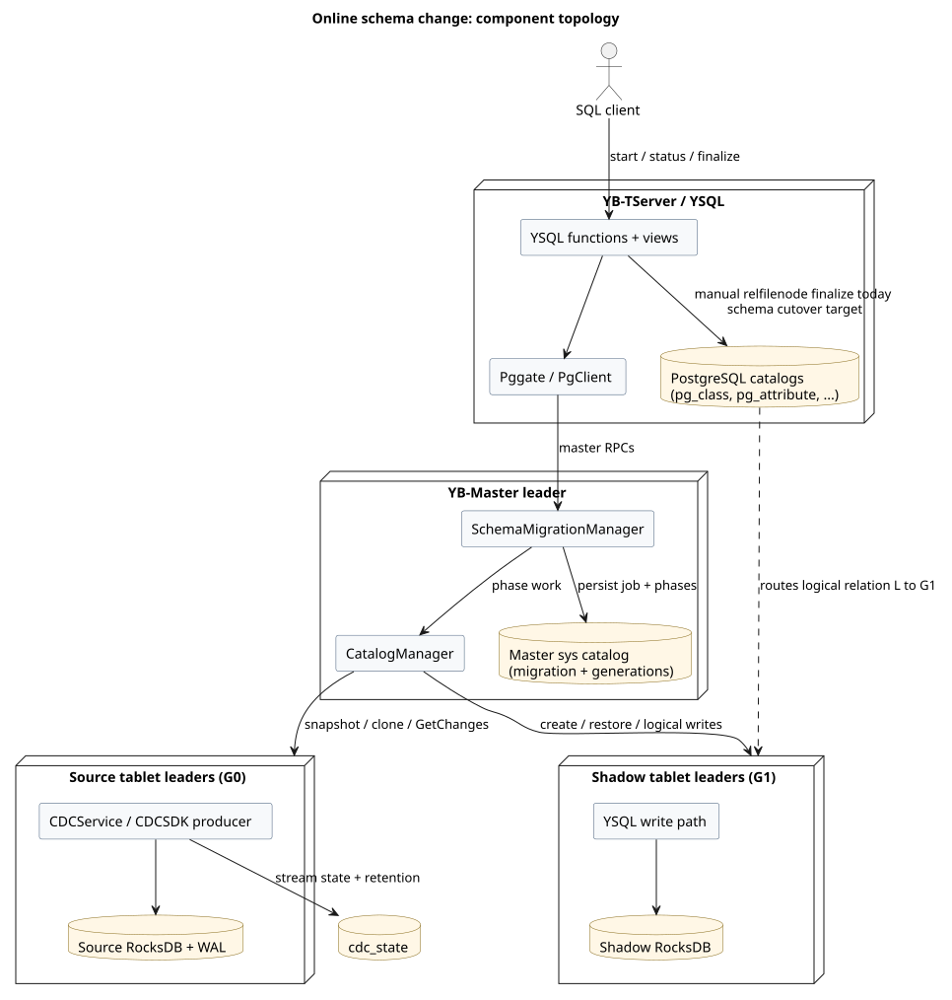

# Overview

## Problem

Some YSQL `ALTER TABLE` operations require a full table rewrite. PostgreSQL's
normal rewrite path creates new storage, copies every row, and swaps the storage
while holding an `ACCESS EXCLUSIVE` lock. For a large distributed table, copy
time is not an acceptable lock duration.

The **target online schema change protocol** moves the expensive work outside
the final cutover window:

1. Create a hidden target physical generation (`G1`).
2. Arm change capture on the active source (`G0`).
3. Copy source data at a fixed snapshot HybridTime (`S`).
4. Replay source transactions committed after `S` into `G1`.
5. Briefly fence writes, drain to a final barrier (`F`), and redirect the
   original logical relation (`L`) to `G1`.
6. Retain then garbage-collect the retired `G0` generation.



PlantUML source: [01-high-level-lifecycle.puml](diagrams/01-high-level-lifecycle.puml).

The current prototype implements steps 1-3, a per-record (not
transaction-preserving) replay prototype for step 4, and separate master/SQL
pieces of step 5. It does not implement the distributed fence or atomic
activation. Writers must be quiesced externally for its final replay/switch
window.

## Why physical generations

YSQL already separates PostgreSQL logical identity from physical storage:

- `pg_class.oid` is the stable logical relation identity (`L`). Views, foreign
  keys, triggers, policies, privileges, and dependencies refer to it.
- `pg_class.relfilenode` selects physical storage. A YSQL DocDB table id encodes
  `database_oid + relfilenode_oid`.

The migration therefore preserves `pg_class.oid` and changes the physical
generation behind it. This is not a MySQL-style table rename.

## Architecture



PlantUML source: [02-component-topology.puml](diagrams/02-component-topology.puml).

The main responsibilities are:

| Component | Responsibility |
|---|---|
| YSQL functions and views | Submit, finalize, cancel, and inspect migrations |
| `SchemaMigrationManager` | Own durable job state and phase transitions |
| `CatalogManager` | Create generations, clone data, replay changes, flip roles |
| CDCSDK on source tablets | Retain and expose committed changes after `S` |
| YBClient write path | Re-encode logical changes against the shadow schema |
| PostgreSQL catalogs | Repoint `pg_class.relfilenode` while preserving `oid` |

## Current prototype flow

The landed phase order is:

```text
NEW
  -> RUNNING[PREFLIGHT]
  -> RUNNING[SHADOW_CREATING]
  -> RUNNING[COPYING]
  -> RUNNING[REPLAYING]
  -> RUNNING[CUTOVER]
  -> SUCCEEDED
```

The implementation currently:

- creates a same-schema, non-colocated shadow generation;
- arms a slot-less, table-bound CDCSDK stream before snapshotting;
- clones/restores the source at `S` using SST hard links;
- replays post-`S` INSERT/UPDATE/DELETE records through logical YSQL writes;
- flips master generation roles; and
- exposes a manual SQL finalize function that repoints `relfilenode`.

This proves the data path, but the final barrier and catalog switch are not yet
one atomic, fenced operation. Writers must currently be quiesced from barrier
selection through SQL finalize. See [Implementation status](implementation-status.md)
and [Cutover and fencing](cutover-and-fencing.md).

## Target flow

The target implementation continuously replays while copy runs, waits until lag
is small, then holds a distributed write fence only for:

```text
acquire fence -> choose F -> drain final tail -> atomic catalog switch
-> invalidate caches -> release fence
```

No full copy, validation scan, or index build occurs under the final fence.

## Design principles

- Preserve the logical PostgreSQL OID.
- Arm retention before choosing `S`; no transaction may fall between copy and
  replay.
- Replay logical rows, not raw packed DocDB values, so the target can have a
  different schema.
- Use at-least-once transport with idempotent apply and durable checkpoints.
- Keep shadows invisible to users, backup enumeration, and external CDC.
- Make every long-running phase resumable and observable by migration id.
- Prefer a short, bounded correctness fence over an unbounded workload lock.
