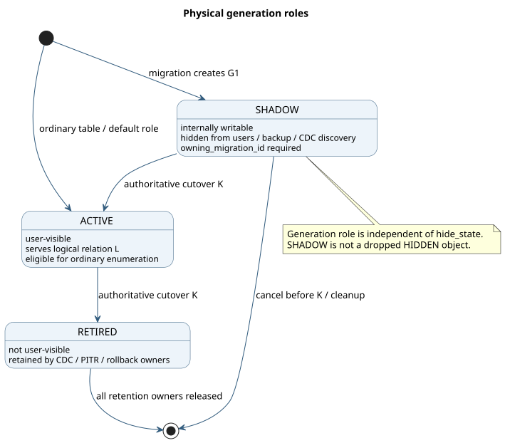

# Physical Generations

## Model

One logical YSQL relation can temporarily own two physical DocDB tables:

```text
L  stable pg_class.oid
G0 active source: database_oid + old relfilenode
G1 shadow target: database_oid + new relfilenode
```

The generation role is distinct from the existing table hide state:

| Metadata | Purpose |
|---|---|
| `hide_state` | A user object was dropped/hidden and may be retained for PITR |
| `physical_generation_role` | Which physical copy backs a live logical object |



PlantUML source: [03-generation-roles.puml](diagrams/03-generation-roles.puml).

## Roles

- `ACTIVE` (default): normal user-visible table generation.
- `SHADOW`: internally writable target generation owned by a migration.
- `RETIRED`: previous active generation retained for recovery/CDC/PITR owners.

`owning_migration_id` links non-active generations to the durable migration job.

## Metadata

`SysTablesEntryPB` includes:

```proto
enum PhysicalGenerationRole {
  ACTIVE = 0;
  SHADOW = 1;
  RETIRED = 2;
}

optional PhysicalGenerationRole physical_generation_role = 43
    [default = ACTIVE];
optional bytes owning_migration_id = 44;
```

Default `ACTIVE` preserves behavior for existing rows and old writers that do
not set the field.

## Visibility

`PersistentTableInfo::visible_to_client()` requires the generation to be
`ACTIVE`. Existing lookup and enumeration paths that use this choke point omit
both `SHADOW` and `RETIRED` generations.

Explicit checks are also required where code intentionally bypasses ordinary
visibility:

- `ListTables(... include_not_running ...)` must still exclude non-active
  generations.
- CDCSDK dynamic discovery must not add the shadow.
- Namespace backup enumeration must select only the active generation.
- Direct operations against a guessed shadow physical id need an internal job
  capability rather than relying only on obscurity.

A shadow is not assigned `hide_state = HIDDEN`: doing that would incorrectly
enroll it in dropped-object GC/PITR behavior.

## Shadow creation

`CatalogManager::CreateShadowGeneration` currently:

1. Requires an active, regular, non-colocated, non-index YSQL source.
2. Copies source schema, partition schema, and tablet count.
3. Reserves a fresh PostgreSQL relfilenode OID.
4. Sets `pg_table_id` to the source logical id.
5. Sets role `SHADOW` and `owning_migration_id` in the initial create request.
6. Creates clone-target tablets in `CREATING` state for later materialization.

The role is present in the first sys-catalog write, so the target never has a
transient user-visible `ACTIVE` state.

## Internal writes to a shadow

Client `OpenTable` uses the visibility-gated `GetTableSchema` RPC and therefore
rejects a `SHADOW` table as "not running". Replay uses
`CatalogManager::BuildHiddenTableForWrite`, which constructs a `client::YBTable`
directly from master schema and partition metadata. The normal client write path
then routes to the shadow without exposing it through public lookup.

## Cutover

Current master-side cutover updates both entries in one sys-catalog batch:

```text
G0 ACTIVE  -> RETIRED
G1 SHADOW  -> ACTIVE
```

This controls master visibility, but YSQL I/O still follows
`pg_class.relfilenode`. The PostgreSQL catalog repoint is a separate step today;
see [Cutover and fencing](cutover-and-fencing.md).

## Upgrade and rollback

- New protobuf fields are appended; the physical sys-catalog table schema does
  not change.
- Old masters ignore the fields and treat tables as default `ACTIVE`. A rolling
  rollback with a live shadow is therefore unsafe and must be rejected or require
  migration cancellation before production enablement.
- No generations are created unless the preview migration path is invoked.

## Remaining work

- Generation-aware request fencing on retired tablets.
- Cleanup ownership and retention intervals.
- Atomic generation groups for heap, indexes, partitions, and sequences.
- Target-schema construction instead of a same-schema clone.
- Long-term logical-to-physical pointer metadata for constant-work activation.
